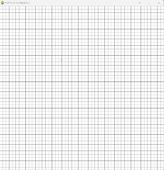

# Welcome To Path Finding Visualizer

- I have implemented the following algorithms for the visualization -
  - Dijkstra
  - Astar

## Project Setup

- Clone the repository
- Install conda and create an environment.
- In the environment install numpy, pygame

## Run Project

- To get the visualization of `Dijkstra` algorithm, execute `python main.py dijkstra`
- To get the visualization of `Astar` algorithm, execute `python main.py astar`. Here instead of 'astar' you can write any other name also just to add a value to args[1], [`TODO: needs to better approach to handle`]

- After you get the grid window, click on any box to mark it `start` point, then click on any second box to mark it `end` point.
- Click on any other boxes to mark them as `barriors`.
- Enter `SPACE` button to start the visualization.
- When the shortest path is found, it is shown at the end.

- Visualization of Dijkstra's algorithm

  

- visualization of Astar algorithm

  
